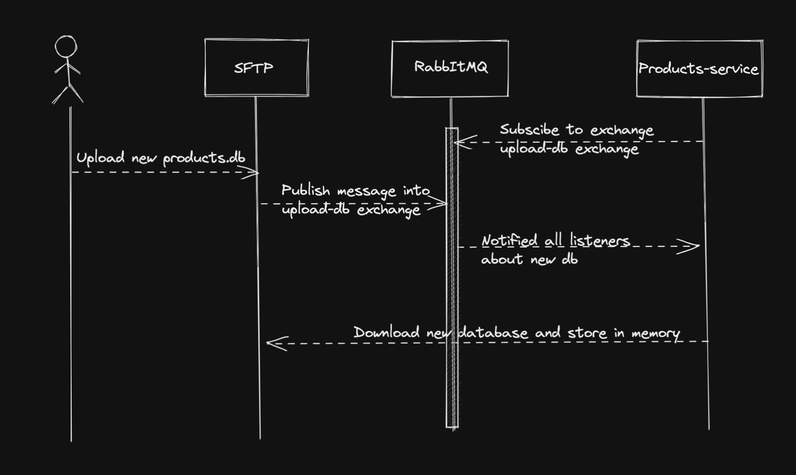

# Choices
In this document you can read about the development team decisions regarding architectural, deployment, complexity, 
separation of concerns, and decoupling. 
## Architectural Decisions

The system architecture is a microservice architecture. That allow for each component to be self-isolated and run 
independently. Microservices, helps to achieve scalability, each service can scale by itself on needs, unlike monolithic 
architecture where scaling required scaling for the entire system.  
In addition, it gives us, the developers the opportunity to separate the workload and takes decisions for 
each component, rather than take decisions as a whole. Inner communication between services is happening through the 
proxy or with a que, which decouple services from each other.

## Deployment Decisions
Our system created with a container base architecture- virtualization. It is an operating system level virtualization 
for deploying and running application. Docker allows us, the developers, to build, run and distribute docker containers. 
Docker helps to reduce complexity of networking between different services, volumes and databases. In addition, docker 
has a public images that can be used by other developers, for example haproxy, redis, rabbitMq, and more. 

Docker improve the development experience, developers can just pull and run containers on their own machine without 
the concerns of installing new software. 
In addition, all docker environment setup in the same way and to move image from development to preproduction and 
production is fairly easy. 
Furthermore, using docker facilitates the creation of microservice architecture, since it is easier to develop and deploy 
separated components.

For production environment, container base architecture, comes with portability in mind, since the whole definition of 
the services stays within the container, that makes deployment on different servers much easier. docker provides a 
self-isolated application, which can only access its own container space, and if any application gets vulnerable, 
it can only harm itself.  

Scalability of container base architecture will demand spinning more containers, and a need for orchestrator, in future 
development we will consider adding kubernetes.

The application is hosted on Azure as a container instances, it is very easy to deploy when using docker compose file.
The containers are stored on Azure Container Registry (ACR). ACR provides fast and private storage for docker images. 
To start deploy the images from ACR the developer can replicate the docker compose environment into self-isolated network
with the same configuration as the local environment. 

Unlike Rest Api, Graphql and proxy, some of our services does not require quick response and can have "cold start", 
while being executed from different events. Those services are deployed as serverless architectures which gives lower cost 
and high computing power, but slower response after cool down. for example our mail service which responsible for sending 
emails on specific events, but does not require instance response, is deployed on serverless architecture with Azure 
Functions. The serverless architecture is used for running a single function, that can be decoupled from other parts of 
the system, but can be triggered by different events. 

## Storage Decisions

## Inner Services Decisions

### Products Service VS SFTP Service
Products service is responsible for providing a products to a client's request over the http protocol with GraphQL server
endpoint. SFTP server is a server where a client can store data and download data. The main idea of the sftp server is 
to expose an endpoint where a client can upload a sqlite database that contains products. When a client would like to 
query the database, it will be accessed through the product service in GraphQL post request. 
Achieving this structure raises some challenges:
 - sqlite is suited for in memory database
 - the products service should access the sftp storage
 - a new database can be inserted to the sftp at anytime
 - notifying the products service that there is a new database 

Firstly to achieve sqlite in memory we needed to create a download capabilities for the product service. By downloading
the sqlite into the products server we could get better performance from the sqlite implementation. But direct communication 
between the SFTP server and the product will couple thies services to decouple them they need to communicate through the 
proxy server. By doing so we are solving the first and the second issue.

However, now when the database is in memory, we reach to the third problem that described above, which mean that there
will might inconsistency between the in-memory database in the products service and a new version of the database on the
SFTP service. To solve this issue we have created a script that listen to the ``products.db`` file and whenever there is 
an updates to this file, it will send a message to the products service. when the products service gets the message, it
will download the file again. 

Now, when solving the constancy issue and the sqlite optimization, we found out that we will have a scalability concern. 
If we scale the products service horizontally and there is a message from the sftp service, only the server that currently 
gets the message (for example in round-robin), will know that there is a new database. In addition, download new database, 
will be an intensive process. 

To answer thies issues, we implemented a Pub/Sub with RabbitMQ, that the SFTP publish a message to the exchange point 
about a new database to download, and all the products services are subscribers to that exchange, and they will download 
the new database when the message arrives.

### Proxy Service
### User Service
### Wishlist Service
### Friends Service
### Auth Service