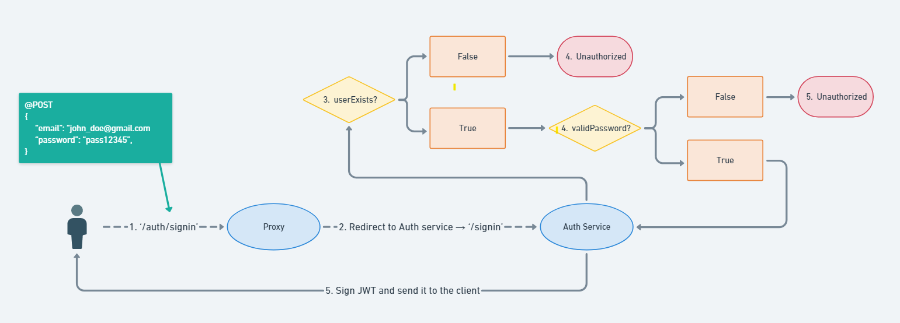

# Proxy

This service was built using `HAProxy` and the `Lua Programming Language`, which we use to extend upon the features _HAProxy_ offers.

_HAProxy_ is a free, open-source service that offers a high availability load balanced and reverse proxy for `TCP` and `HTTP` requests.

_Lua_ is a lightweight cross-platform programming language designed for embedded use in applications. It is written in `ANSI C`, which makes it highly portable.

Our proxy service is responsible with the internet traffic management towards our other services. It sits directly between the client application and our microservice network. Alongside that, it also acts as a `Firewall`, so as to prohibit unauthorized access to our services.


... (maybe more explanations)

### Pre-Requisites

-   Docker
-   IDE / Code Editor
-   At least one running backend application

### Configuration & Flow of Events

The proxy configuration consists of 'Frontend' (The API Gateway) and 'Backend' (Server) sections.

```cfg
frontend api_gateway
  bind *:80
  mode http
  timeout client 60s

  acl auth path_beg -i /auth
  acl user path_beg -i /user
  acl products path_beg -i /products
  acl wishlist path_beg -i /wishlist
  acl friends path_beg -i /socket.io

  http-request lua.authorize
  http-request set-header Cookie Claims=%[var(txn.user)]

  use_backend auth-service if auth
  use_backend user-service if user
  use_backend products-service if products
  use_backend wishlist-service if wishlist
  use_backend friend-status-service if friends
```

This 'frontend' is in charge of HTTP requests and redirects them to the proper service based on the root path used in the endpoint. Before that, however, the gateway executes the `lua.authorize` function in order to authorize access to the services. More explanations on this in the flow diagram.

```cfg
frontend api_sftp
  bind *:22
  mode tcp
  timeout client 60s
  use_backend sftp-service
```

This 'frontend' takes care of SFTP requests, based on the port usage and redirect to the only available 'backend'.

```cfg
backend user-service
  balance roundrobin
  mode http
  http-request replace-path /user(/)?(.*) /\2
  acl authorized_routes path -m beg /invite/accept /user
  acl post_req method POST
  acl authorized var(txn.authorized) -m bool
  http-request deny unless authorized || authorized_routes post_req
  server user user-service:3000 check
```

This is one example of a 'backend', where we specify the type of backend, the load balancing type, the server used (based on the container name and its internally exposed port) and then other configurations mostly necessary for security.

First off, we remove the root path from the request, for convenience purposes (the services wouldn't have to create an endpoint like [@GET]'/user/user', but instead just [@GET]'/user'), then we check whether the routes are authorized or not (The User Service has 2 paths that are already authorized - the ones used by Auth Service), and then finally, we check if our JWT verification passed, based on the result of the  `lua.authorize`.


### Dependencies

Some of the dependencies necessary are shown below. This is only a summary of the major ones, because some of them have their own dependencies as well.

| Dependency  |
| ----------- |
| lua         |
| json.lua    |
| base64.lua  |
| mime.lua    |
| openssl.lua |
| socket.lua  |

In order to install these dependencies, an install script is necessary, which will be executed when the docker image starts building.

### Environment Variables

```
JWT_SECRET=
```

### Docker Setup

Following upon the explanation from the **_Dependencies_** section, the dockerfile initially downloads the _HAProxy_ image and then copies our install script to the desination and executes it in order to install the dependencies.

Afterwards, our configuration files are copied as well and we finally launch our proxy.

```dockerfile
FROM haproxytech/haproxy-ubuntu:2.6

WORKDIR /usr/local/etc/haproxy/
COPY ./install.sh /usr/local/etc/haproxy/

RUN sed -i -e 's/\r$//' ./install.sh
RUN ["chmod", "+x", "/usr/local/etc/haproxy/install.sh"]
RUN /usr/local/etc/haproxy/install.sh luaoauth

COPY ./authorization.lua /usr/local/etc/haproxy/
COPY ./base64.lua /usr/local/etc/haproxy/
COPY ./haproxy.cfg /usr/local/etc/haproxy/

ENTRYPOINT ["/docker-entrypoint.sh"]
CMD ["haproxy", "-f", "./haproxy.cfg"]
```

Then, in the `docker-compose.yml` file:

```yml
services:
.
.
    proxy:
        build: ./haproxy
        ports:
            - '80:80'
            - '22:22'
        environment:
            - JWT_SECRET=${AUTH_SERVICE_JWT_SECRET}
        restart: on-failure
```

### Local Installation

As far as the installation of the proxy is concerned, the service cannot work by itself, so it is highly recommended to install it together with the other services through our docker setup:

```bash
$ docker-compose up --build
```

\*Note: It is not necessary to specify the docker-compose file in the command above, since the CLI will use the default `docker-compose.yml` we have inside our project directory.

### Local Usage

The service runs on both `Port 80` (_HTTP_) and `Port 22` (_SFTP_), based on the environment set in the docker-compose.yml, and it is the only service that actually exposes its ports to the outside. The other services are, naturally, only accesible through the proxy.

# Auth Service

The Auth Service is given the purpose of providing the client application access to the rest of our services. It does that in synergy with the proxy service. The first endpoints the client would hit are the ones from this service. This would take place during the **_Sign In_** / **_Sign Up_** operations. After performing the aforementioned actions, the client receives an **_Authorization_** **token** to be used in other subsequent requests.

### Pre-Requisites

-   Node
-   Docker
-   IDE / Code Editor
-   [MongoDB Cloud Atlas Account](https://cloud.mongodb.com/)
-   MongoDB IP Address Whitelisting

### Server & Flow of Events

The server was built using `Node` and `Express` as the core pieces, together with a few dependencies solely focused on the purpose of this service: Authentication.

Below there will be shown the 2 main flows covered by this microservice. The flows illustrate other services as well, when necessary, in order to emphasize their the clarity and completeness.

Sign Up Flow:


\*Important note: This flow, ideally, works in sync with the `User Service`'s create user operation. Hence, we need to make sure that both services contain the same users at all times. Moreover, we cannot afford a delay (i.e. The User Service adds the newly created user from Auth Service later). For this to happen, the `Sign Up` should only complete when both transactions succeed in their own service.

Sign In Flow:



### Dependencies

| Package name | Version |
| ------------ | ------- |
| axios        | ^1.1.3  |
| bcryptjs     | ^2.4.3  |
| express      | ^4.18.2 |
| jsonwebtoken | ^8.5.1  |
| mongoose     | ^6.7.2  |
| dotenv       | ^16.0.3 |

### Database

The database type used for this service was `NoSQL`, precisely a `Document Database`: **_MongoDB_**.

First and foremost, a cluster needs to be created on your Cloud Atlas account. Then you can create a database and then a collection, which, for this service, is the only one we actually need.

Inside the Express server, we connect to the database using `mongoose`, which is a MongoDB Object Modelling Tool. We do this using the connection string provided by our cluster as follows:

```javascript
import mongoose from 'mongoose'

const mongoURI = `mongodb+srv://${process.env.AUTH_SERVICE_MONGO_USERNAME}:${process.env.AUTH_SERVICE_MONGO_PASSWORD}
@gift-wish-auth.rpteshg.mongodb.net/${process.env.AUTH_SERVICE_MONGO_DATABASE}?retryWrites=true&w=majority`

try {
    mongoose.connect(mongoURI, {
        useNewUrlParser: true,
        useUnifiedTopology: true,
    })

    mongoose.connection.on('connected', () => {
        console.log('Successfully connected to the mongo db instance')
    })
} catch (error) {
    console.log('Unable to connect to the database:', error)
}
```

After that, we need to define our `AuthUser` schema inside our server following the document format:

```javascript
_id: ObjectId(String),
email: String,
name: String,
username: String,
password: String
```

\*Note: `_id` is implicit and doesn't have to be manually set in an `AuthUser` object. The other fields are required.

Once the setup is done, we can access an `AuthUser` model in our application like so:

```javascript
import mongoose from 'mongoose'

const AuthUser = mongoose.model('AuthUser')
```

We will use this model to perform operations on our database. An example showing how to create a document inside our `authusers` collection:

```javascript
const authUser = new AuthUser({ email, password, username, name })

await authUser.save()
```

Not only that, but we can also use the model to automate certain functionalities (e.g. Password Hashing), or add methods to it (e.g. Compare Passwords). I will show the first example:

```javascript
authUserSchema.pre('save', async function (next) {
    let user = this
    if (!user.isModified('password')) {
        return next
    }

    try {
        user.password = await cryptSync(user.password)
        next()
    } catch (err) {
        next(err)
    }
})
```

### Environment Variables

```
APPID=
AUTH_SERVICE_MONGO_USERNAME=
AUTH_SERVICE_MONGO_PASSWORD=
AUTH_SERVICE_MONGO_DATABASE=
AUTH_SERVICE_JWT_SECRET=
```

### Docker Setup

The docker setup for this service is quite straight-forward. In a nutshell, all we need to do is use a node image (latest, preferably), copy the necessary files to the desired directory and then run the `install` and `start` commands.

```dockerfile
FROM node:18-alpine

WORKDIR /home/node/app
COPY package*.json ./

RUN npm install

COPY . .

CMD npm start
```

Then, in the `docker-compose.yml` file:

```yml
services:
.
.
  auth-service:
      build: ./modules/auth-service
      environment:
          - APPID=4500
          - AUTH_SERVICE_MONGO_USERNAME=${AUTH_SERVICE_MONGO_USERNAME}
          - AUTH_SERVICE_MONGO_PASSWORD=${AUTH_SERVICE_MONGO_PASSWORD}
          - AUTH_SERVICE_MONGO_DATABASE=${AUTH_SERVICE_MONGO_DATABASE}
          - AUTH_SERVICE_JWT_SECRET=${AUTH_SERVICE_JWT_SECRET}
```

### Local Installation

Depending on whether you want to run the service by itself or together with all the other services, the installation can differ a bit. For a self-contained installation (not recommended), all you would have to do following the cloning of the repository would be:

```bash
$ cd modules/auth-service
```

```bash
$ npm install
```

However, for a complete showcase, it is advisable to use the docker setup instead. So, after opening the repository in your code editor, execute:

```bash
$ docker-compose up --build
```

\*Note: It is not necessary to specify the docker-compose file in the command above, since the CLI will use the default `docker-compose.yml` we have inside our project directory.

### Local Usage

This service runs on `Port 4500`, based on the environment set in the `docker-compose.yml` file, or on `Port 5000` by default.

If trying to access the service through the proxy, you can do it following the flows illustrated towards the beginning of the section. You can also disregard the port, as everything is taken care of by docker, as long as it is properly configured.

# Products Service

Products service is a microservice that responsible for communication between a client and a SqlLite database.
Please make sure that you have theis running on your machine before starting the service:

-   node version 18 install
-   pnpm install [installation guide](https://pnpm.io/installation)
-   RabbitMQ service up and running
-   optional: Redis

The microservice is exposing a graphql server on port 8080 by default, or any port that will be specified in
the environment variables by the key `PRODUCTS_SERVICE_PORT`. The products microservice needs to know where
the SqlLite file is located, and it can be specified as environment variable under the key `PRODUCTS_SERVICE_DATABASE_URL`.

For lunching the server, please make sure that you have a RabbitMQ server, with exchange under the name `update-db`
The connection to the RabbitMQ server can be specified in the environment variables under `RABBITMQ_SERVICE_HOST` ,
`RABBITMQ_SERVICE_USER` and `RABBITMQ_SERVICE_PASSWORD`.

If you would like to add Redis, the default connection string is `redis://localhost:6379` otherwise you can change
it in the environment variable `PRODUCTS_SERVICE_REDIS_URL`

After all the services in place you can run `pnpm dev`

The products service is using typescript that provides better development experience and helps to catch errors before compiling

The Products service uses [Prisma](https://www.prisma.io/docs) as ORN which helps to create types for the data in the database.
To get start with Prisma all that need to be specified is this part of the schema.Prisma

```
generator client {
  provider = "prisma-client-js"
  output = "./client"
}

datasource db {
  provider = "sqlite"
  url      = env("PRODUCTS_SERVICE_DATABASE_URL")
}
```

After you add theis lines, you can execute `npx prisma db pull` and the object types will be generated automatically.
The next step is to run `npx prisma generate`, this will generate the client library for access the database.

Since the products service is using typescript, one of the library that this service uses is TypeGraphQL. TypeGraphQL helps
to generate from classes in Typescript the graphql schema. For more information please
[read here](https://typegraphql.com/docs/introduction.html#why).

For creating graphql endpoints we use [Apollo](https://www.apollographql.com/docs/). It is providing
a simple API for integration with nodeJS. Apollo jas a straight forwards setup and easy to maintain.

To add a caching layer we used [Keyv](https://www.npmjs.com/package/keyv) which works with json objects. Apollo server

# SFTP

The SFTP service used for receiving and storing SqLite files. The main file that this server is responsible for storing
is `products.db`. In addition, the SFTP file should be able to inform other services if the products.db file has been 
change.

To run the SFTP container, please install first Docker. After you install Docker, you can build the `Dockerfile` with

`docker build --build-arg SFTP_SERVICE_USERNAME=${user} --build-arg SFTP_SERVICE_PASSWORD=${password} -t ${image-name} .`

and run it with

`docker run -dp 22:22 ${image-name}`

The base image of SFTP that we are using is `atmoz/sftp` which can gives us the base sftp capabilities, in addition for
customisation.

In the SFTP image there is three scripts:

`sftp-config.sh`: A bash script that runs on the image initialization, and responsible for changing access level of the
sftp storage. The access granted to the user that logs into the server and gives the right to modified his set directory.

`publish-update`: This script is responsible for listening to a change on the user's products file. The script uses
the library `inotify-tools`. when the file is being change it will execute the python script `send.py`

`send.py`: A python script that send a message into the exchange point upload-db in the RabbitMQ server.

## RabbitMQ

Uses for asynchronous communication between the SFTP service and the products service. The service RabbitMQ service uses 
the default management package which provide in addition to the RabbitMQ, a UI where you can visualize the exchanges and users. 
The management UI used for creating the additional users and exchanges. 
To run the RabbitMQ server you can execute ``docker build -t ${image-name} . `` and to run the image ``docker run -d -p 5672:5672 15672:15672 ${image-name}``. 
If you would like to access the UI please have a look in the username and password in the environment variables. 

## Redis
Redis is used for caching queries for the products service. to start container of redis please insert in your terminal
``docker build -t ${image-name} . `` and to run the image ``docker run -d -p 5672:5672 15672:15672 ${image-name}``.

# User Service
In this section we’ll go over the technologies used in building the user service, it’s dependencies, structure, docker setup, and environment variables.

### Pre-Requisites

* Node
* Docker
* IDE / Code Editor
* [Neo4j AuraDB Account and DB instance](https://neo4j.com/cloud/platform/aura-graph-database/)

### Internal dependencies
The user service is built using NodeJS, with TypeScript and ExpressJS.
User Service internal dependencies are as follows:

| Package name        | Version     |
|---------------------|-------------|
| @azure/storage-blob | 12.12.0     |
| axios               | 1.1.3       |
| dotenv              | 16.0.3      |
| express             | 4.18.2      |
| jsonwebtoken        | 8.5.1       |
| multer              | 1.4.5-lts.1 |
| neo4j-driver        | 5.2.0       |
| uuid                | 9.0.0       |
| cookie-parser       | 1.4.6       |
| ts-node-dev         | 2.0.0       |
| ts-node             | 10.0.1      |
| rimraf              | 3.0.2       |


These dependencies include both production dependencies and development dependencies. 
Most notable development dependencies are ts-node, ts-node-dev, and rimraf. 
Modules ts-node and ts-node-dev were imported for running TypeScript, and together offer cool functionalities such as ‘hot reload’, 
even when running inside docker containers. 

Command script for hot reload inside a docker container ```ts-node-dev --poll <path/app.ts>```. 

The module rimraf, was imported to properly get rid of the ```./build``` directory before rebuilding the project using the ```tsc``` command. 
We had some trouble rebuilding properly, so this module came to the rescue.

### Structure
Structure src directory inside the user service
```text
.
├── database
|   └── neo4j.ts
├── middleware
|   ├── profile-picture-guard.ts
|   └── user-guard.ts
├── models
|   ├── enums
|   |   └── FriendStatus.ts
|   ├── Email.ts
|   ├── Friend.ts
|   ├── InviteToken.ts
|   └── User.ts
├── repositories
|   ├── friend-repository.ts
|   ├── invite-repository.ts
|   ├── relationship-repository.ts
|   └── user-repository.ts
├── routes
|   ├── friend-routes.ts
|   ├── invite-routes.ts
|   ├── profile-picture-routes.ts
|   ├── relationship-routes.ts
|   └── user-routes.ts
├── services
|   ├── email-server-service.ts
|   ├── friend-service.ts
|   ├── invite-service.ts
|   ├── jwt-service.ts
|   ├── profile-picture-service.ts
|   ├── relationship-service.ts
|   └── user-service.ts
├── templates
|   └── email-invitation-templates.ts
├── validation
|   └── input-validation.ts
├── app.ts

```

### Docker setup
User service makes use of two docker compose files, one for development and one for production. Within the dockerfile, 
we have ‘stages’ for development and production that instruct docker compose how to build the container. It will start 
from the top down, first containerizing the development environment, and if instructed to run the production stage, 
it will use the newly created ```./build``` directory from the development container, as the root project for the 
production container, using only production dependencies.

Dockerfile:
```dockerfile
FROM node:18-alpine as development

WORKDIR /usr/src/app

COPY package*.json ./

RUN npm install

COPY . .

RUN npm run build

FROM node:18-alpine as production

WORKDIR /usr/src/app

COPY package*.json .

RUN npm install --only=production

COPY --from=development /usr/src/app/build ./build

CMD ["node", "build/app.js"]
```

Then for specifying which stage to run, you set the 'target' in the docker compose file, example for development:
```dockerfile
    user-service-development:
        build:
          context: ./modules/user-service
          target: development
        environment:
          - NODE_ENV=development
          - ...
        ...
```

### External dependencies
#### Neo4j:
User service stores all user data in a Neo4j graph database except for the user's profile picture.

Neo4j has unique constraints for ```username, email and userId```.

Node structure is quite simple:
```USER-[FRIENDS_WITH]->USER``` where the ```USER``` node contains all relevant information about the 
user: ```userId, name, username, email and signupDate``` while the ```FRIENDS_WITH``` 
relationship contains all relevant information about user relationships: ```status, and originatorUserId```.

The ```status``` in relationship holds enum values found in ```FriendStatus.ts``` in the source code. 
While ```originatorUserId```represents the user that sent a friend request to the other user. 

For further details, see ```docs/documents/instructions.md``` in the user service section.

#### Azure blob storage:
User service stores all user profile pictures in azure blob storage. Saving the files in the format ```<username>_profile-picture.png```.
The file format extension ```.png``` is hard coded.

#### Email Service:
User service uses an external dependency to send emails for when users want to invite other users to join the application.
When/if a user accepts the invite, they will automatically be friends, persisted in the Neo4j database.

### Security
User service is already protected against unauthenticated users, however there were concerns with how the user service
exposes endpoints that could manipulate other users in the application. 
For example, an endpoint for updating or deleting a user, in order to protect users from each other, we set up the 
middleware found in ```user-guard.ts```. 

This middleware checks the users request body, and if the request includes a
userId or username, both of which can be used to get, put, post and delete information. The guard will override the 
appropriate fields with the userId or username of the user that sent the query.
In some cases we want to be able to circumvent the guard, in these cases we have an array of routes that are allowed to 
pass through the guard.

Example query that would be intercepted, would be when a user tries to delete another user.
If a user sends a request to delete another user, the user guard will swap out the userId in the request, replacing it 
with the sender's userId, resulting in the user deleting themselves. 

Although not the most refined approach and in future iterations we'd be pressed to refine it, we found it a bit funny as is.


### Environment variables needed for the user service
```text
USER_SERVICE_PORT=
USER_SERVICE_NEO4J_URL=
USER_SERVICE_NEO4J_USERNAME=
USER_SERVICE_NEO4J_PASSWORD=
USER_SERVICE_AURA_INSTANCENAME=
USER_SERVICE_JWT_SECRET=
USER_SERVICE_SIGNUP_URL=
EMAIL_SERVER_URL_LOCAL=
EMAIL_SERVER_URL_PROD=
EMAIL_SERVER_ACCESS_TOKEN=
EMAIL_SERVER_SENDER_EMAIL=
EMAIL_SERVER_SENDER_PASSWORD=
```

# Wishlist Service
In this section, it will be presented the technologies used in building the wishlist service, its environment variables, dependencies,  docker setup, and an explanation of how the service was created.

### Technologies
This service has been implemented to provide the client the possibility to manipulate wishlists through API calls. The server has been created with Nodejs using express to serve the application and having the data stored into a MongoDB database. The mongoose library has been also used as an object data modeling (ODM) to manage the data in an easier manner.

### Environment variables needed for the user service
```text
WISHLIST_CONNECTION_URL
WISHLIST_SERVICE_PORT
```
These environmental variables have been created to hide the port number and the connection url used to connect with the database.

### Internal dependencies
Wishlist Service is using the following internal dependencies:

| Package name        | Version     |
|---------------------|-------------|
| express             | ^4.18.2     |
| mongoose            | ^6.7.2      |
| dotenv              | ^16.0.3     |
| cookie-parser       | ^1.4.6      |

### Docker setup 
Friend service is using a dockerfile which has 2 stages, one for development and one for production. These 2 instruct the docket compose how to build the container. The lines are executed sequentially, so first, the development environment will be containerized. Then, if the product stage is specified in docker compose file, it will copy the everything from the development container and use it as the root project, applying only the production dependencies.

### How was created

The service was implemented to provide to the client the possibility to read, create, update or delete wishlists from the database.

From the server side perspective, when a client requests to read a specific wishlist, the system checks if the user's id already belongs to an existing wishlist, in which case it will return it back to the user. Otherwise, a new wishlist will be created. This is possible because, at this point, we know the user is authenticated and authorized to do this operation. 

Besides this, the user is also able to update their wishlist with products that are stored in the products service. However, if the user decides to erase their account, the wishlist associated to this account can be removed as well from the database.

# Friend Service
In this section, we’ll go over the technologies used in building the friends service, its dependencies, environment variables,  docker setup, and an explanation of how the service was created.

### Technologies
This service has been implemented to offer the client the possibility to display the social statuses of a user's friends in real time without reloading the page. The server has been implemented with Nodejs using express, http and Socket.io libraries. Besides this, Typescript was also used to add an extra layer of security and to catch potential errors.

### Environment variables needed for the user service
```text
FRIEND_STATUS_SERVICE_PORT
```
This environment variable has been created to hide the port number.

### Internal dependencies
Friends Service is using the following internal dependencies:

| Package name         | Version     |
|----------------------|-------------|
| express              | ^4.18.2     |
| socket.io            | 4.5.3       |
| dotenv               | ^16.0.3     |
| cookie-parser        | ^1.4.6      |
| @types/cookie-parser | ^1.4.3      |
| @types/express       | ^4.17.14    |
| ts-node-dev          | ^2.0.0      |
| ts-node              | ^10.9.1     |
| rimraf               | ^3.0.2      |
| typescript           | ^4.9.3      |

### Docker setup
Friend service is using a dockerfile which has 2 stages, one for development and one for production. These 2 instruct the docket compose how to build the container. The lines are executed sequentially, so first, the development environment will be containerized. Then, if the product stage is specified in docker compose file, it will copy the ./dist directory from the development container and use it as the root project, applying only the production dependencies.

### How was created
The service is designed so that when an authorized user connects, he/she will see their list of friends and their online status ('online', 'offline', 'not registered'). At the same time, the user will be seen by his/her online friends with the status 'online'. 

Another aspect is that even though an user opens multiple tabs or logs in from different devices, their status will switch to 'offline' only when all the instances have been closed.

Internally, when a client application is open, an event is automatically emitted to this service. With this event, the client should pass an object which contains the list of friends identified through their id's. On the server side, the user id, which is obtained from the cookie claims, is used to create a new socket room. This is really important because the rooms are stored into a global variable which can be accessed by any room.

After this, a function will return back an array with the list of friends and their online status. Inside this function, the algorithm loops through the list of friends and determines the online status of each friend based on a couple of conditions. 

One of them is the existence of the friend's username. If this value is null, this means the user sent an invitation link to an email address which was not accepted by this person. This happens because, once the invitation is sent, a new user will be automatically created in the user service and added as a friend of the inviter. Until the invitation is accepted and an account is created, this new user will only contain the email of the invitee. Thus, a status of 'not registered' will be added to this friend.

The other one is the existence of a socket room with the same id as the friend's. This is why we mentioned the importance of a global variable for socket rooms. Once an user becomes online, their id is added to this global variable which will help the server to determine which friend is either online or offline. In case the socket room (which is the friend's id) exists, an 'online' status will be added to this friend and an event will be sent to the client which will inform the friend that the user is online. Otherwise, the function simply adds the status of 'offline' for this friend. 

Then, at the end of this event, another event will be emitted to the client, sending an array with the current social statuses. 

The last event is triggered when a user closes the website. When this happens, the server will loop through the list of friends and will emit to all the online friends, the 'offline' status of the user. This action is executed only if the user has closed all the open tabs with this application including all the devices where is logged in.

### Friend Status Flow


# Email Service
The email service is a serverless function on Azure, a “Function application” consisting of a single function. This is the only service part of the expose part of the project that is not running within a docker container in Azure’s container registry.

This service is set-up to be generic, meaning that the service could be re-used for other applications, as it does not contain any templates or the like. Receiving a request of sending an email, the request should contain three objects in JSON format:

```JSON
{
   "sender": {
       "email": "exampleEmail@gmail.com",
       "password": "examplePassword"
   },
   "email": {
       "to": "exampleEmail.2@gmail.com",
       "subject": "subject string",
       "html": "<p>html, as the email body</p>",
       "text": "regular text, as the email body"
   },
   "notification": {
       "email": "exampleEmail.3@gmail.com",
       "onFailure": true,
       "onSuccess": false
   }
}
```

As seen in this example request sent to the email service, the first object specifies the sender email. 
This object specifies which email address the email service should send from, and is the only object that 
ties the email service to this application. The service contains an array of ‘sender’ email addresses, 
which consist of the sender email address and the password to be able to send an email with that email address.

The second object specifies both to which email the service should send to, the emails subject, and body.

The third object, is an option available to send a notification email as well as the ‘regular’ email, 
notifying the email specified in the object about the email sent. The two fields ```onFailure, and onSuccess```, 
specify whether a notification email should be sent if an sending the email to the ‘email’ object was successful, or if it was unsuccessful. 
If the appropriate fields are set to true, the notification email includes errors or success messages 
that occur when sending an email. An example notification email looks like this:

```text
This email address was registered to get this notification of an error that occurred in our email server. 
Date: 2022-12-11T18:27:15.676Z

Error Messages:
";sender.email: \"invalidEmail@invalidEmail.invalidDomain\" does not exist"

Information about the failed email: 
{"to":"exampleEmail@gmail.com","subject":"Subject check","html":"
something cool
"}
```

In this example the sender email was invalid.

An example response sent back from the email service to the 'client' that sent the email request:

```JSON
{
   "success": [
       "Valid Content",
       "Authentication success",
       "valid notification email",
       "Emails accepted: [\"exampleNotificationEmail@gmail.com\"]"
   ],
   "errors": [
       ";sender.email: \"invalidEmail@invalidEmail.invalidDomain\" does not exist"
   ],
   "sentEmails": [
       {
           "accepted": [
               "exampleNotificationEmail@gmail.com"
           ],
           "rejected": [],
           "messageTime": 561,
           "messageSize": 865
       }
   ]
}
```

## Security
The method ```authLevel``` is set to ```function```. 
Meaning that the security setup for the email service is quite simple at the moment, 
where the only restrictions set for sending with the default email address is the 
environment variable ```EMAIL_SERVER_ACCESS_TOKEN```, as used in the user service.

Possible future security restrictions would include an html sanitizer, and as it is currently set up, 
sender email addresses have the option to be restricted with an additional field ‘password’ in the ‘sender’ object. 
However, this is more of an administration restriction than a security measurement.

## Dependencies
We only have one dependency that is being used by this service at the moment, which is the module ‘nodemailer’, version ‘6.8.0’. 
Additional modules that are not being used but might be used in the future are ‘amqplib’ for RabbitMQ integration, and ‘node-html-parser’ for html sanitation.

## Environment variables
Environment variables used in the email service are set in the file ```local.settings.json```, and includes the following variables:
```text
"SMPT_HOST":
"SMPT_PORT":
"SMTP_USER":
"SMPT_PASSWORD":
"ERROR_EMAIL":
"ERROR_PASSWORD":
"NOTIFICATION_EMAIL":
"NOTIFICATION_PASSWORD":
```

Furthermore, there is another file, that is gitignored, for emails that can be used in the ‘sender’ object. This file is named ```gmail-accounts.json``` and has the following structure:
```
{
 "GMAIL_ACCOUNTS": [
   {
     "email": 
     "password": 
     "access_password": 
   },
   {
     "email":
     "password":
   }
 ]
}
```

As seen here in this example, we can have a sender email account that has the fields email, and password or an optional additional field ```access_password```, which, if set, will not allow a sender to be used without the field ```password``` in the ‘sender’ object within the request to the email service. The field ```password``` here in ```gmail-accounts.json``` is the password created within gmail, to be able to send an email through their services with that account.
