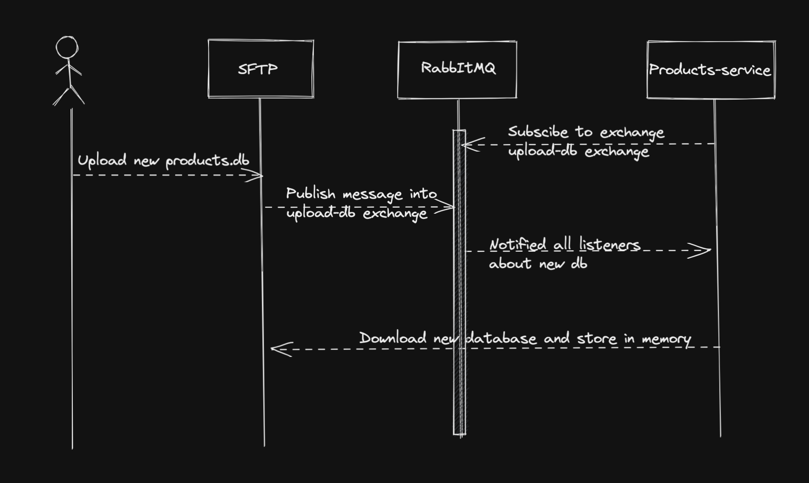

# How to

## _Local environment_
In order to create the project on your local machine you will need to have docker.
You can find explanation on how to install docker here: https://docs.docker.com/get-docker/ .

After you have installed docker, you will need to set up environment variable.  
To get the official env please contact us.

After you set up the env, locate your terminal in the root directory and execute

```
docker compose up
```

## Online Version

This app can be found online at _________. 
This version is host on azure. 

# Products
The products service is a service that expose for the user a graphql endpoint where it can fetch a list of products 
or a single product by id. 
After initialising the app the documentation for the graphql server can be found in http://{endpoint}/products

The products are stored in a single table in the sql server. the structure is as following 

| id     | name | sub_title | description | category | sub_category | price  | link  | overall_rank |
|--------|------|-----------|-------------|----------|--------------|--------|-------|--------------|
| TEXT   | TEXT |  TEXT     | TEXT        | TEXT     | TEXT         | REAL   | TEXT  | REAL         |


The database type is sqlite that exist inside the products service. If you would like to update the db and create new 
entry you should follow the current schema that describe in the table above. 
To upload the new db you should access the sftp server and replace the current db file with your new file. The file name
has to be named ```products.db```. The product service is listening to a que, and in a case that there is a new message in that
que, it will download the new database file to the product service (view sequence diagram below)

The sftp service can be access on localhost:22. The sftp server connected to a que (RabbitMQ) and in a case that the 
```products.db``` has been updated it will add a message to the que.

In case that you would like to change the current db structure please contact the development team, and we will update it
as you wish.

The products service is using redis to store you most recent results for any request that has been sent to product 
and products. The cache has time to live of 60 seconds

# SFTP
In the application you will find sftp server that runs on port 22 (sftp:$user:password@$endpoint) the credentials can be found in the .env. 
It can be accessed with any sftp client (fx: [Cyberduck](https://cyberduck.io/), [FileZilla](https://filezilla-project.org/))
After accessing the server you can view or replace the products.db. Please note that you should follow the schema as 
described at the products section, or communicate with the development team if needed.





# Nice Logo path
The service is providing a logo which is hosted on azure cdn you can get the url for accessing the cdn through the development team

# Environment Variables
Here you can see all the required envs, to get the access to them please contact the development team
```
# AZURE STORAGE
STORAGE_VOLUME_USERNAME=
STORAGE_VOLUME_PASSWORD=
USER_SERVICE_AZURE_BLOB_STORAGE_CONNECTION=
USER_SERVICE_AZURE_BLOB_STORAGE_CONTAINER=

# SFTP_SERVICE
SFTP_SERVICE_PASSWORD=
SFTP_SERVICE_USERNAME=
SFTP_SERVICE_URL=

# RABBITMQ SERVICE
RABBITMQ_SERVICE_HOST=
RABBITMQ_SERVICE_USER=
RABBITMQ_SERVICE_PASSWORD=

# PRODUCTS SERVICE
PRODUCTS_SERVICE_POST=
PRODUCTS_SERVICE_DATABASE_URL=

# REDIS SERVICE
PRODUCTS_SERVICE_REDIS_URL=

# AUTH SERVICE
AUTH_SERVICE_MONGO_USERNAME=
AUTH_SERVICE_MONGO_PASSWORD=
AUTH_SERVICE_MONGO_DATABASE=
AUTH_SERVICE_JWT_SECRET=

# USER SERVICE
USER_SERVICE_PORT=
USER_SERVICE_NEO4J_URL=
USER_SERVICE_NEO4J_USERNAME=
USER_SERVICE_NEO4J_PASSWORD=
USER_SERVICE_AURA_INSTANCENAME=

USER_SERVICE_JWT_SECRET=
USER_SERVICE_SIGNUP_URL=

# EMAIL SERVER (Note - used in USER SERVICE)
EMAIL_SERVER_URL_LOCAL=
EMAIL_SERVER_URL_PROD=
EMAIL_SERVER_ACCESS_TOKEN=
EMAIL_SERVER_SENDER_EMAIL=
EMAIL_SERVER_SENDER_PASSWORD=

# WISHLIST SERVICE
WISHLIST_SERVICE_PORT=
WISHLIST_CONNECTION_URL=

# FRIEND STATUS SERVICE
FRIEND_STATUS_SERVICE_PORT=
```

