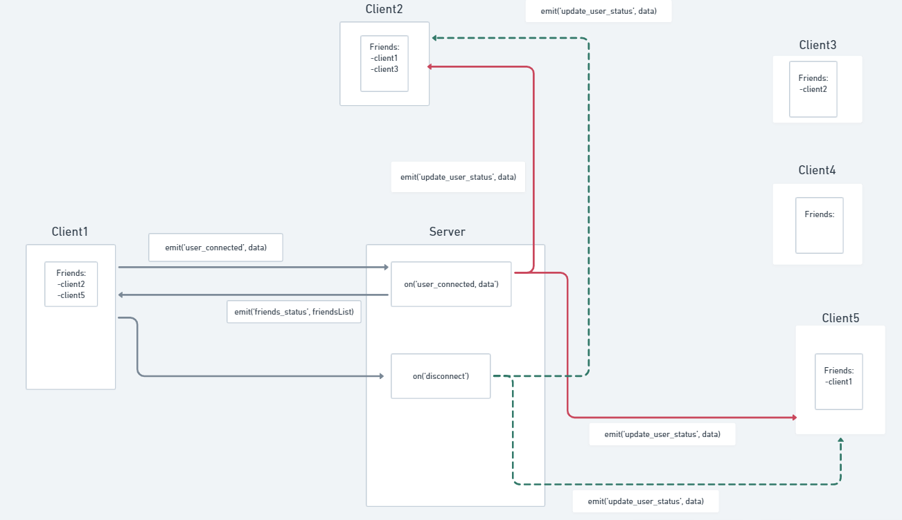

# How to

## _Local environment_
In order to create the project on your local machine you will need to have docker.
You can find explanation on how to install docker here: https://docs.docker.com/get-docker/ .

After you have installed docker, you will need to set up environment variable.  
To get the official env please contact us.

After you set up the env, locate your terminal in the root directory and execute

**NOTE:** If you're using an ARM architecture machine, for example an M1 macbook, you have to change the dockerfile in products to be node:18 instead of node:18-alpine.

```
docker-compose up
```

NOTE: Email service/server is hosted on Azure, and is not part of this repository.
The command mentioned above, will spin up the 'production' version of the user-service, 
using the email server on Azure and therefore you don't need to set it up locally.

## Online Version

This app can be found online at _________. 
This version is hosted on Microsoft Azure.

# Proxy 
Our project was developed using Microservices as an architecture style. To access any of our services you have to go through our proxy, which acts both as an ```API Gateway``` as well as an ```Authorization Firewall```. The Proxy was built with ```HAProxy``` together with some ```Lua``` scripts, that help facilitate more advanced operations, such as Authorization.

As far as the usage is concerned, all you need to know is the main host and the corresponding paths that lead to the correct services. With a few exceptions, every request needs to be authorized. As mentioned above, we take care of that before the requests actually reach a service. So, in order for you to get your request validated by the proxy you need to append an ```Authorization token``` to the headers of the request, token that you would receive upon login.

### Service HTTP Paths - ```Port:80```
```/auth``` --> Auth Service

```/user``` --> User Service

```/products``` --> Products Service

```/wishlist``` --> Wishlist Service

```/``` --> Friend Status Service (The WebSocket connection only requires the host in this case, because we only have one Socket server, so rerouting to a different path is not necessary)

### Service SFTP Path - ```Port: 22```
```/``` --> SFTP Service

### *Notes: 
* There are other services that are only meant for internal use, thus not being exposed through the proxy.

* Most, if not all the paths described in each individual service showcase the full path, which includes the root path of the service described above.


# Auth
Lorem ipsum

# Products
The products service is a service that expose for the user a graphql endpoint where it can fetch a list of products 
or a single product by id. 
After initialising the app the documentation for the graphql server can be found in http://$endpoint/products

The products are stored in a single table in the sql server. the structure is as following 

| id     | name | sub_title | description | category | sub_category | price  | link  | overall_rank |
|--------|------|-----------|-------------|----------|--------------|--------|-------|--------------|
| TEXT   | TEXT |  TEXT     | TEXT        | TEXT     | TEXT         | REAL   | TEXT  | REAL         |


The database type is sqlite that exist inside the products service. If you would like to update the db and create new 
entry you should follow the current schema that describe in the table above. 
To upload the new db you should access the sftp server and replace the current db file with your new file. The file name
has to be named ```products.db```. The product service is listening to a que, and in a case that there is a new message in that
que, it will download the new database file to the product service (view sequence diagram below)

The sftp service can be access on localhost:22. The sftp server connected to a que (RabbitMQ) and in a case that the 
```products.db``` has been updated it will add a message to the que.

In case that you would like to change the current db structure please contact the development team, and we will update it
as you wish.

The products service is using redis to store you most recent results for any request that has been sent to product 
and products. The cache has time to live of 60 seconds

# SFTP
In the application you will find sftp server that runs on port 22 (sftp://$user:$password@$endpoint) the credentials can be found in the .env. 
It can be accessed with any sftp client (fx: [Cyberduck](https://cyberduck.io/), [FileZilla](https://filezilla-project.org/))
After accessing the server you can view or replace the products.db. Please note that you should follow the schema as 
described at the products section, or communicate with the development team if needed.


# User Service
**ROOT:** /user

All endpoints are documented ```In this format``` will be the full route to that endpoint, but in each section, the relevant suffix might be used.

The words endpoint(s) and route(s) might be used interchangeably in this section.

Beneath all routes, you'll see if the endpoint requires a body or parameter, optionals will have a ```?``` suffix.
Some optionals might not make a difference unless you disable the userGuard and profilePictureGuard respectively, as explained here below.

**NOTE:** For convenience, we will in some cases refer to Models (First letter capital) and ENUMS (all capital) 

## User Guard and Profile Picture Guard
All routes/endpoints in the user service are protected by the middleware "userGuard".
Meaning that it will not work to for example read other users friends, update or delete another user, etc.
So even though some endpoints accept a userId in the body, it will be overridden by the middleware to be that of the user sending the request.

During development this might be annoying, to disable the guard, simply comment out the line with ```app.use(userGuard)``` in ```app.ts```.

Same applies for the profile picture endpoints (e.g. as a user, you can not CRUD another users profile picture), as all of them are protected by "profilePictureGuard" but due to another middleware being used for these routes, you'll have to disable the guard for each endpoint.

## Models and Enums
Models and enums are used in this documentation for output information from the endpoints in this service.
Here, as with routes, optionals will have suffix: ```?```
### User
```
{
  userId, string,
  name: string,
  username: string,
  email: string,
  signupDate: Date,
  friends?: Friend[]
}
```

**NOTE:** A user object has an optional field of a friends array which is not used except for a single endpoint ```/user/user/w-friends```.

### Friend
```
{
  friendId: string,
  friendName: string,
  friendEmail: string,
  friendStatus: FriendStatus,
  requestedBy?: string
}
```

### FriendStatus
ENUM: ```INVITED | REQUESTED | ACCEPTED```

## Friends and relationship information
Friend objects include an enum value in the field “friendStatus”, with the three possible values seen above.
For better context, see what each of them means:

**INVITED:**
User has sent an invite to a friend that has not yet registered to the application. The ```Friend``` object will have temporary values in the fields: ```userId, name, username, and signupDate```.
If the friend accepts the invitation from the user, these values will be updated and the ```friendStatus``` field set to ```ACCEPTED```.

**ACCEPTED:**
A friend with friendStatus ```ACCEPTED```, means that either the user or the friend has accepted an invitation to register the application, or accepted a friend request, from either the friend or the user (whoever sent the invitation/friend-request)

**REQUESTED:**
Either the user has sent a friend request to the friend, or the friend has sent a friend request to the user.
If ```friendStatus == REQUESTED```, there will be an additional field in the friend object ```requestedBy```, who’s value will be the ```userId```, of the user that sent the friend-request.
So if ```requestedBy == friendId```, the user has a friend request from this (potential) friend.
If ```requestedBy == userId```, the user has sent a friend request to this (potential) friend.


## Routes
### Overview (All user service routes)
```/user/friend/all``` @[GET]

```/user/friend/by-status``` @[GET]

```/user/invite/send``` @[POST]

```/user/invite/accept``` @[POST]

```/user/user``` @[GET | POST | PUT | DELETE]

```/user/w-friends``` @[GET]

```/user/relationship``` @[POST | PUT | DELETE]

```/user/profile-picture``` @[GET | POST | DELETE]


### Friend Routes (2)
**ROOT:** /friend
#### Endpoints


##### Get all friends
```/user/friend/all```

**Input:**
```
{
  userId?: string
}
```

**Output:** 
```Friend[]```

##### Get All friends by status
```/user/friend/by-status```

**Input**
```
{
  userId?: string,
  "status": FriendStatus
}
```
**Output:** 
```Friend[]```

**NOTE:** valid status values: ```INVITED, REQUESTED, ACCEPTED```

### Invite Routes (2)
**ROOT:** /invite
#### Endpoints

##### Send friend invitation to email
Will send invitation to the email ```friendEmail``` to join the application, if signed up through the invitation link, user will automatically become senders friend.

**Signup link integration:** 
Set signup link env: **USER_SERVICE_SIGNUP_URL**
A JWT token will be appended as parameters of the url as ```token```.
This token must be added to the signup form as an input field (presumably hidden).

```/user/invite/send```

**Input:**
```
{
  userId?: string,
  friendEmail: string
}
```

**Output:**
```{inviteStatus: "Success"}```

##### Accept friend invitation from email [AUTH SERVICE]
*This endpoint is for **auth-service**, endpoints for signing up a user can be seen in the auth-service section of this document.*

```/user/invite/accept```

**Input:**
```
{
  userId?: string,
  name: string,
  username: string,
  email: string,
  token: JWT_TOKEN (from invitation email)
}
```

**Output:**
```User```

### Relationship Routes (3)
**ROOT:** /relationship
These routes are for creating, updating and deleting relationships between users.
*If you want to get users friends, see Friend routes.*
#### Endpoints

##### Modify friend relationships
```/user/relationship```

##### @PUT
To update an existing relationship
**Input:**
```
{
  userId?: string,
  friendId: string,
  status: FriendStatus
}
```


**Output:**
```Friend```

**NOTE:** valid status values: ```INVITED, REQUESTED, ACCEPTED```
##### @POST
To create a new relationship
**Input:**
```
{
  userId?: string,
  friendId: string,
}
```

**Output:**
```Friend```

##### @DELETE
Use if friend deletes a relationship or rejects friend request.
**Input:**
```
{
  userId?: "exampleuserid",
  friendId: "exampleFriendId",
}
```

**Output:**
```{deleted: boolean}```


### Profile Picture Routes (3)
**ROOT:** /profile-picture
Routes for creating, deleting and updating users profile picture.
All profile pictures are saved as: ```<username>_profile-picture.png```

#### Endpoints
```/user/profile-picture```
##### @GET
Get users profile picture.

**Input (parameters):**
```/:username```

**Output:**
```multipart/form-data```

##### @POST
Create/Upload a user profile picture.

**Input:**
```
{
  file: multipart/form-data [FILE]
  username: multipart/form-data [TEXT]
}
```

**Output:**
```{message: string}```


##### @DELETE
Delete a user profile picture.

**Input:**
```
{
  username: string
}
```

**Output:**
```{message: string}```


### User Routes (5)
**ROOT** /user
**NOTE:** user routes will have duplicate substrings ```/user``` in the route.
#### Endpoints

```/user/user```
##### @GET
Get user

**Input (parameters):**
```
{
  userId?: string
}
```

**Output:**
```User```

##### @POST [AUTH SERVICE]
Create a user.
*Note this route is only for **aut-service**, end-users will not be able to query this endpoint due to guards and proxy settings*

**Input:**
```
{
  userId?: string,
  name: string,
  username: string,
  email: string
}
```

**Output:**
```User```


##### @DELETE
Delete a user.
**NOTE:** A user querying this endpoint will delete themselves, trying to delete another user, they'll instead delete themselves (happy hacking!).
*If you want to disable that functionality during development, as mentioned before, disable the userGuard.*
**Input:**
```
{
  userId?: string
}
```

**Output:**
```User```

##### Get user with friends
```/user/user/w-friends```

Get user with all their friends.

**Input:**
```
{
  userId?: string
}
```

**Output:**
```User```

**NOTE:** A user object has an optional field of a friends array which is not used except for at in this endpoint.

# Email Service/Server
Email server is currently deployed to Azure, part of a function application.
No integration is needed on this part of the application, however if something is not working and you want to rule it out as the culprit...

Email Server link: ```EMAIL_SERVER_URL_PROD```?code=```EMAIL_SERVER_ACCESS_TOKEN```
The value for ```EMAIL_SERVER_URL_PROD``` and ```EMAIL_SERVER_ACCESS_TOKEN``` can be found in the environment variables.
### Sending an email
Example request
```
{
  "sender": {
    "email": "wishlist.mail.sender@gmail.com"
  },
  "email": {
    "to": "someemail@gmail.com",
    "subject": "Subject check",
    "html": "<p>something cool</p>",
    "text": ""
  },
  "notification": {
    "email": "somenotification@gmail.com",
    "onFailure": true,
    "onSuccess": true
  }
}
```

#### Explanation
**Sender:**
*;TLDR; just keep it the same.*
Our email service is set up to be able to send emails from different email accounts.
This was made for future proofing, sending notification mails and error messages.
Sender object has an optional field: ```password```, for emails that we want to restrict sending with for admins.

**email:**
Your bread and butter.
Either set html or text for the body of the email - **please don't try to hack this**, html sanitazion isn't setup yet.

**notification:**
Mainly for debugging purposes, **note that it will slow down the sending process quite a bit!**.
Set the onFailure and onSuccess values to true to receive an email notification that will give you insights into what it's doing.
Tried our best to assemble all error and success messages throughout the process of sending an email, and it should give sufficient information to know what went wrong, if it failed.

### Email Response

Example of a successful email sent response to the notification email if ```onSuccess``` is true.
```
{
  "success": [
    "Valid Content",
    "Authentication success",
    "Emails accepted: [\"someemail@gmail.com\"]"
  ],
  "errors": [],
  "sentEmails": [
    {
      "accepted": [
        "someemail@gmail.com"
      ],
      "rejected": [],
      "messageTime": 448,
      "messageSize": 271
    }
  ]
}
```

# Wishlist Service
All the routes require an "Authentication" token in request headers in order to response. Once the user is authorized, they will have an userId in the request cookies claims which will be used to verify the identity of the user in the routes. This way, the client is not responsible to send the userId explicitly anymore.

## Models
Models are used to for output or input information of the API calls for this service.

### Wishlist
``` 
{
  userId: String,
  products?: Product[]
}
```

### Product (Not finished)
```
{
  name: String,
  url: String
}
```


## Routes

**ROOT:** /wishlist

### Oveview
```/wishlist/all``` @[GET]

```/wishlist/friends``` @[GET]

```/wishlist``` @[GET]

```/wishlist``` @[PATCH]

```/wishlist``` @[DELETE]

#### Endpoints:

##### Get all wishlists
```/wishlist/all``` @[GET]

**Input:**
```empty```

**Output:** 
```
Wishlist[]
```

#### Get wishlists based on list of id's
```/wishlist/friends``` @[GET]

**Input:**
```
{
  "friendsList": userId[]
}
```

**Output:** 
```
Wishlist[]
```

#### Get wishlist (create one if it doesn't exist)
This endpoint has a double responsiblity. The server will initially check if the wishlist exists. If it doesn't, then it will create a new wishlist, otherwise it will return the existing one. 
```/wishlist``` @[GET]

**Input**
```empty```

**Output** (if user is new)
```
{
  "message": String,
  "wishlist": Wishlist
}
```

**Output** (if user exists)
```
Wishlist[]
```

#### Patch wishlist with products
```/wishlist``` @[PATCH]

**Input**
```
{
  "products": Product[]
}
```

**Output** 
```
{
  "userId": String,
  "products": Product[]
}
```

#### Delete wishlist
```/wishlist``` @[DELETE]

**Input**
```empty```


**Output** 
```
{
  "message": String
}
```

# Friend Status Service
This service has been implemented to offer the users the possibility to display the social statuses of their friends in real time without reloading the page.
The server is implemented with Socket.io library, so the communication is done through the WebSocket protocol with polling as a fallback option.
All the events require an "Authentication" token in request headers in order to response. Once the user is authorized, they will have an userId in the socket cookies claims which will be used by the socket server.


## Models
Models are used to for output or input information of the socket events for this service.

### Friend
```
{
  "username": String,
  "userId": String
}
```

### FriendWithStatus
```
{
  "username": String,
  "userId": String,
  "status": String
}
```

## Events

### Client to Server events:

Event ```user_connected```

**Argument**
```
{
  "friendsList": Friend[]
}
```

### Server to Client events:

Event ```friends_status```

**Argument**
```
FriendWithStatus[]
```

Event ```update_user_status```

**Argument 1**
```
{
  "userId": String,
}
```
**Argument 2**
```
{
  "status": String
}
```

This is a diagram which represents the flow of events


# Nice Logo path
The service is providing a logo which is hosted on azure cdn. The address to logo is https://giftwishinglogo.blob.core.windows.net/newcontainer/Smile.svg.png

# Environment Variables
Here you can see all the required envs, to get the access to them please contact the development team
```
# AZURE STORAGE
STORAGE_VOLUME_USERNAME=
STORAGE_VOLUME_PASSWORD=
USER_SERVICE_AZURE_BLOB_STORAGE_CONNECTION=
USER_SERVICE_AZURE_BLOB_STORAGE_CONTAINER=

# SFTP_SERVICE
SFTP_SERVICE_PASSWORD=
SFTP_SERVICE_USERNAME=
SFTP_SERVICE_URL=

# RABBITMQ SERVICE
RABBITMQ_SERVICE_HOST=
RABBITMQ_SERVICE_USER=
RABBITMQ_SERVICE_PASSWORD=

# PRODUCTS SERVICE
PRODUCTS_SERVICE_PORT=
PRODUCTS_SERVICE_DATABASE_URL=

# REDIS SERVICE
PRODUCTS_SERVICE_REDIS_URL=

# AUTH SERVICE
AUTH_SERVICE_MONGO_USERNAME=
AUTH_SERVICE_MONGO_PASSWORD=
AUTH_SERVICE_MONGO_DATABASE=
AUTH_SERVICE_JWT_SECRET=

# USER SERVICE
USER_SERVICE_PORT=
USER_SERVICE_NEO4J_URL=
USER_SERVICE_NEO4J_USERNAME=
USER_SERVICE_NEO4J_PASSWORD=
USER_SERVICE_AURA_INSTANCENAME=

USER_SERVICE_JWT_SECRET=
USER_SERVICE_SIGNUP_URL=

# EMAIL SERVER (Note - used in USER SERVICE)
EMAIL_SERVER_URL_LOCAL=
EMAIL_SERVER_URL_PROD=
EMAIL_SERVER_ACCESS_TOKEN=
EMAIL_SERVER_SENDER_EMAIL=
EMAIL_SERVER_SENDER_PASSWORD=

# WISHLIST SERVICE
WISHLIST_SERVICE_PORT=
WISHLIST_CONNECTION_URL=

# FRIEND STATUS SERVICE
FRIEND_STATUS_SERVICE_PORT=
```

